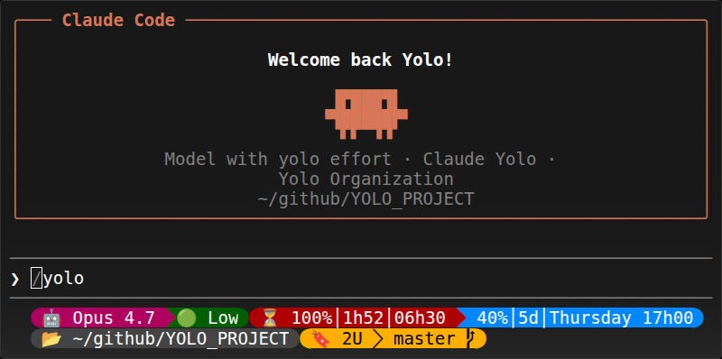

# CLAUDE_CODE_CONFIG

<p align="center">
  
</p>

## Install

```sh
curl -fsSL https://raw.githubusercontent.com/MickaelBlet/CLAUDE_CODE_CONFIG/refs/heads/master/install.sh | sh
```

Installs:
- [Claude Code](https://claude.ai)
- [RTK (Rust Token Killer)](https://github.com/rtk-ai/rtk)
- This config